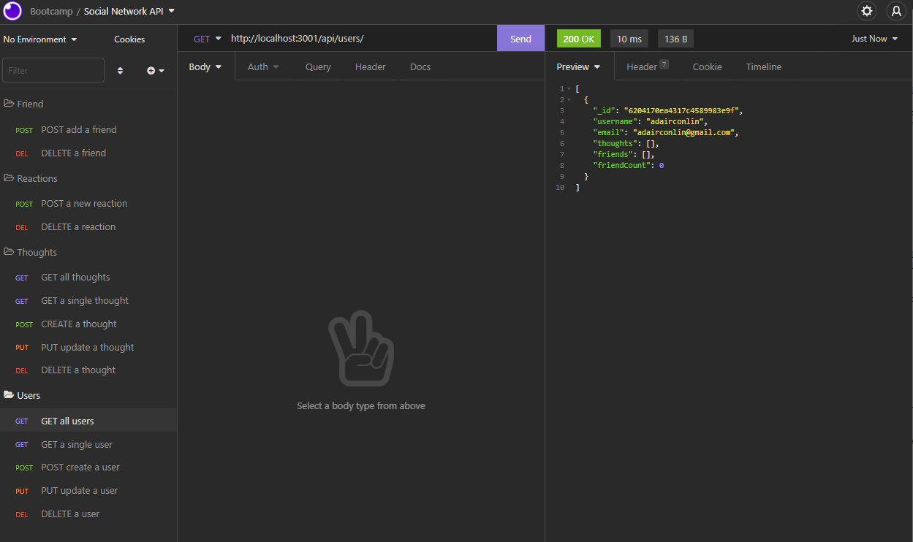

# Social Networking API

## Description
An application where users can share their thoughts, reacts to friends thoughts, and create a personal friends list. For this application, I used Express.js for routing, MongoDB as a databse, and the Mongoose DM. The focus of this project is to understand how to build and structure the API for a very common networking site. This is currently a back-end application that requires Insomnia to interact with the database through the given API's.

Watch my walkthrough video on how the API routes function together [here](https://watch.screencastify.com/v/zFX77cdPB61lVHngHv4P).

Below you can see the API routes that this application offers.

## Questions
If you have any questions on this project, feel free to reach me through my [GitHub profile](https://github.com/adairconlin), or email me at adairconlin@gmail.com.